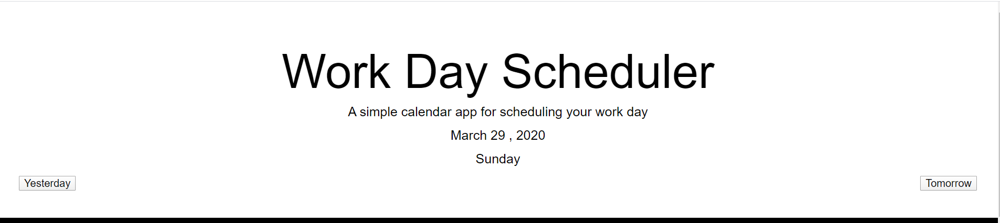
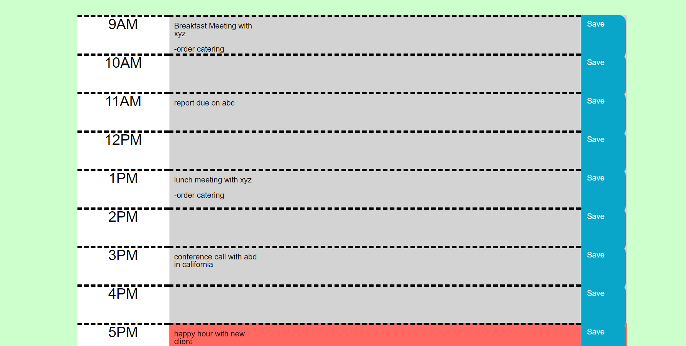
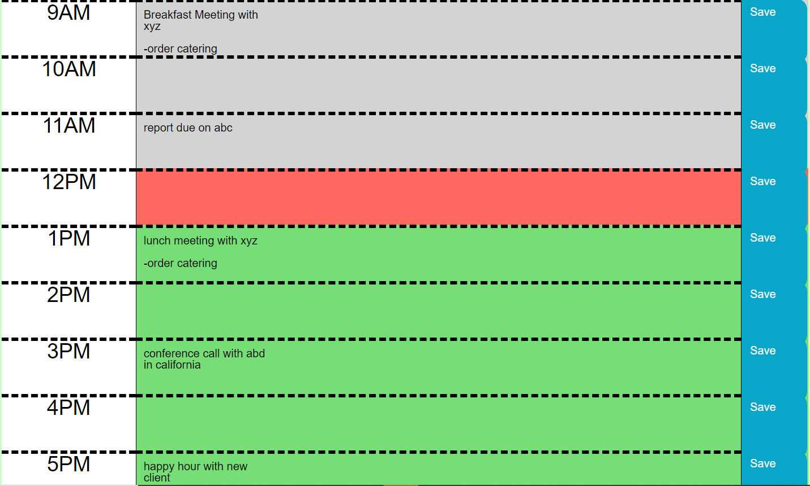

# Daily-Planner-ECB

This is a work day Scheduler using jquery. The assignment was to create a simple calendar application that allows the user to save events for each hour of the day. This app will run in the browser and feature dynamically updated HTML and CSS powered by jQuery.

# Where I started

I started with getting the date under Work Day Scheduler to reflect the current date and day of the week. I then made two different buttons one saying "yesterday" and one saying "tomorrow".

# The Table in the middle

After the buttons were made I started on the table that includes the schedule. I made a row append to the container that included three columns(time column,input column and a save button). I then added attributes to the table so it would all fit on one row.

# Finishing touches

After the table was created I worked on showing the tense of the hours and local storage of the events.

# What was Hard

I am still trying to figure out local storage. I ran into a lot of problems with it.

# What I want to work on

As this is still a work in progress I would like to come back and work on three things. One thing is i would like yesterday and tomorrow to have different events. The next thing i want to work on is a clear button. And finally i would like to learn how to go from this daily scheduler into a weekly scheduler.
# Link
https://eleanorburgess0940.github.io/Daily-Planner-ECB/

